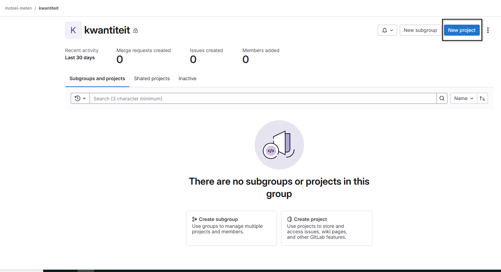
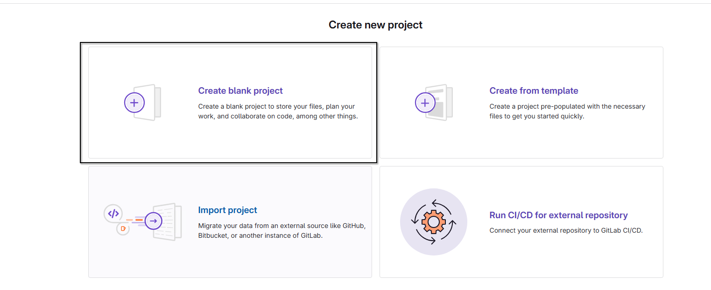
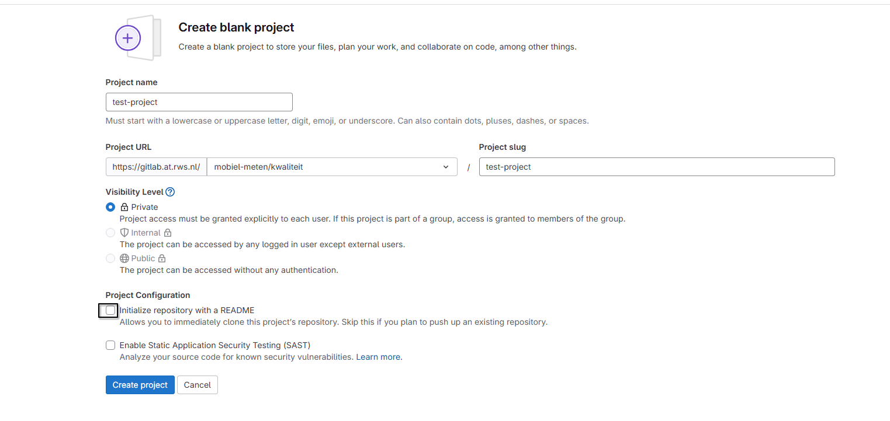
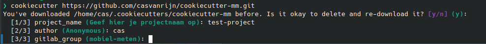
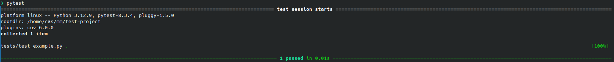
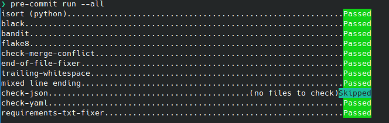
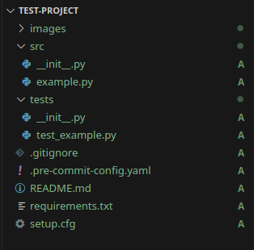
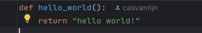
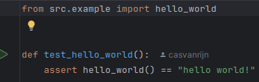

# Cookiecutter Mobiel Meten

Cookiecutter is een tool die gebruikt wordt om python projecten te initialiseren met
een consistent formaat, zodat iedereen binnen mobiel meten redelijk op dezelfde manier werkt, 
en basis tooling zoals testen en code formatting beschikbaar is.

## Hoe maak ik een nieuw project aan?

Als je een nieuw project wilt beginnen binnen de Mobiel Meten gitlab doe je dit volgens de volgende stappen:

### Voer de volgende stappen op gitlab uit:

1. Maak een nieuwe lege repository aan op https://gitlab.at.rws.nl/mobiel-meten binnen een van de groepen
(bodemligging, general, kwaliteit, kwantiteit, mmtoolbox)

2. Maak een leeg project aan 

3. Maak een nieuw project aan en geef een projectnaam op + ZET "Initialize repository with a README" uit

### Voer de volgende stappen lokaal uit:

1. Ga naar de folder waarin je de projectmap wilt hebben
2. open een terminal op de locatie waarin je de projectmap wilt hebben
3. installeer cookiecutter als je deze nog niet hebt met `conda install -c conda-forge cookiecutter` als je conda 
gebruikt of `pip install --user cookiecutter` als je pip gebruikt
4. run de command `cookiecutter git@gitlab.at.rws.nl:mobiel-meten/general/cookiecutter.git` als je 
gevraagd wordt om de cookiecutter opnieuw te downloaden klik op enter (yes)
5. Je wordt nu gevraagd 3 vragen te beantwoorden 

   - Voor project_name vul je dezelfde naam is als de projectnaam die je in gitlab hebt opgegeven.
   - Voor author vul je je eigen naam in
   - gitlab_group mag je leeg laten, dan wordt automatisch mobiel-meten gebruikt
6. Nu is er een folder aangemaakt met de naam `<project_name>`. In deze folder zijn een aantal standaard files 
aangemaakt (Voor meer info over deze files zie 'Hoe werkt een cookiecutter project?' hieronder). 
Ga deze folder in, in je terminal met `cd <project_name>`
7. initieer git met `git init --initial-branch=main`
8. installeer het project me `conda install --file "requirements.txt"` of `pip install -r requirements.txt`
9. test of pytest werkt met `pytest`

10. installeer pre-commit met `pre-commit install`
11. voeg alle bestanden toen om naar git gepushed te worden met `git add .`
12. controlleer of pre-commit werkt met `pre-commit run --all`

13. verwijs het project naar de gitlab repo met `git remote add origin git@gitlab.at.rws.nl:mobiel-meten/<groep>/<projectnaam>.git` 
als je SSH gebruikt of `git remote add origin https://gitlab.at.rws.nl/mobiel-meten/<groep>/<projectnaam>.git` als je HTTPS gebruikt
14. commit de files naar git met `git commit -m "Initial commit"`
15. push nu de files git met `git push --set-upstream origin main`

Nu zou je een nieuw project hebben op de Mobiel Meten gitlab (hoera!)

## Hoe werkt een mobiel meten cookiecutter project?

Graag willen we binnen mobiel meten dat iedereen op ongeveer dezelfde manier werkt, zodat het 
makkelijker is om je weg te vinden in projecten van anderen, plus wat functionaliteit automatisch 
beschikbaar maken. 

### Project structuur

Een project gebouwd met de mobiel meten cookiecutter heeft de volgende structuur

- In de `images` folder staan images voor de README of overige afbeeldingen.
- In de `src` folder plaats je al je python scripts, er is al een example.py script als voorbeeld, 
die mag je verwijderen.
- In de `tests` folder plaats je alle testen voor je python scripts. deze files gebruiken de volgende
naam conventie: `test_<naam_van_script_om_te_testen>.py`. Als je dan in de hoofdfolder `pytest` draait
worden alle tests in deze map gedraaid. 
- `.gitignore` is een file die ervoor voorkomt dat lokale configuraties per ongeluk op gitlab terecht komen
- `pre-commit-config.yaml` bevat de pre-commit configuratie.
- `README.md` is de file die op de gitlab pagina te zien is. Hierin beschrijf je hoe je de scripts 
binnen dit project kan gebruiken
- `requirements.txt` bevat een aantal basis python packages die de cookiecutter/mobiel meten veel gebruiken zodat deze
makkelijk allemaal in 1x geinstalleerd kunnen worden. Kijk vooral wat hierin zit.
- `setup.cfg` bevat de configuratie voor flake8 (styling van de code)

### Pre-commit 

pre-commit is een tool die gebruikt wordt om automatisch de styling van je code te fixen en
om te controlleren of je voldoet aan de standaarden, en je code niet te ingewikkeld is voor anderen. 

pre-commit heeft de volgende functies:
- isort: alfabetisch ordenen van alle imports
- black: automatisch verbeteren van de code format
- flake8: checken of de code voldoet aan de regels opgestend in `setup.cfg`
- end-of-file-fixer: zorgt ervoor dat elke file met 1 lege lijn eindigt
- trailing-whitespaces: verwijderd lege spaties aan het einde van een regel
- check-json: controleerd of json files correct zijn
- check-yaml: controleerd of yaml files correct zijn 
- requirements-txt-fixer: sorteerd alle imports in requirements.txt alfabetisch

### Pytest

Om je code automatisch te testen kan je testen kan je pytest gebruiken.
Als voorbeeld is er een `example.py` in de src folder. Hierin staat 1 functie:

Om deze te testen is er een `test_example.py` in de test folder

Deze test checked of er ook echt "hello world!" uit de functie komt.
