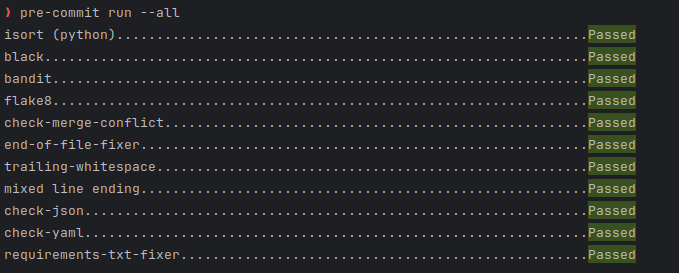

# Welcome

This is a project created with the mobiel meten cookiecutter. Here you find some basic
information about how to use a project created by this cookiecutter.

## Installation

To install {{cookiecutter.__project_slug}}, run the following commands in the main folder ({{cookiecutter.__project_slug}}):

### Conda

    git clone https://gitlab.com/{{cookiecutter.gitlab_group}}/{{cookiecutter.__project_slug}}.git
    cd {{cookiecutter.__project_slug}}
    conda install --file "requirements.txt"

### pip

    git clone https://gitlab.com/{{cookiecutter.gitlab_group}}/{{cookiecutter.__project_slug}}.git
    cd {{cookiecutter.__project_slug}}
    pip install -r requirements.txt

## Run tests

To run pytest after installing the project run the following command in the main folder ({{cookiecutter.__project_slug}}):

    pytest

## Pre commit

To run pre-commit to fix code styling and check for complexity first run the following command once:

    pre-commit install

Then to check files all files run:

    git add .
    pre-commit run --all

this should result in the following:

If you see the that some of the checks failed, run it again since most errors are
fixed by auto-repair.

If you still have failed checks after running it a second time, you need to manually fix them.
